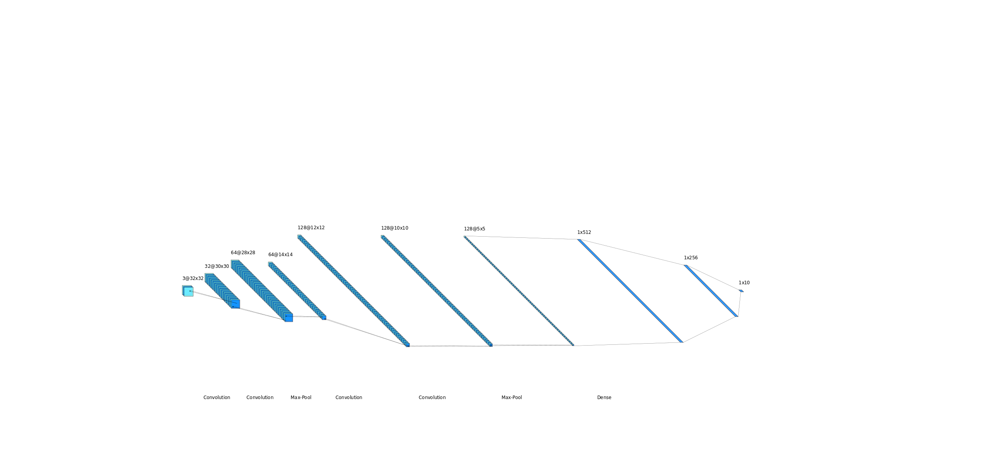
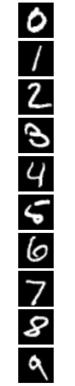
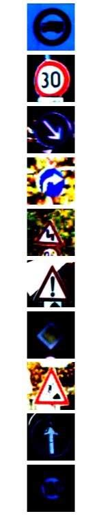
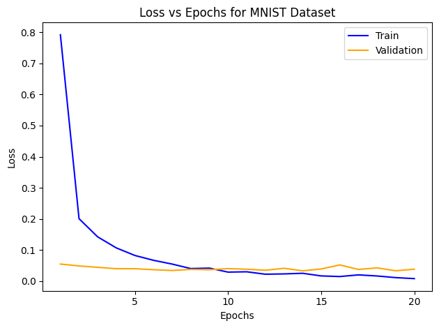
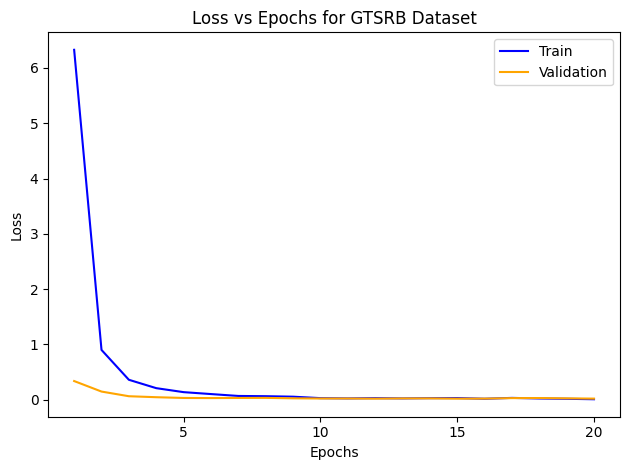

# Enhancing the Robustness of Deep Neural Networks
Repository for work on Robust Neural Networks MQP completed to satisfy the senior thesis graduation requirement at Worcester Polytechnic Institute \
Authors: Alasdair Campbell and Jared Lasselle \
Paper: [https://digital.wpi.edu/show/2v23vz553](https://digital.wpi.edu/show/2v23vz553)

### Abstract
Deep neural networks have demonstrated remarkable accuracy for most image classification machine learning tasks.  However, these networks remain susceptible to adversarial attacks, where slight perturbations in input data produces a misclassification.  Without effective defense, this vulnerability  creates  a  significant  obstacle  to  the  practical  applications  of neural networks.  Therefore, in this paper we propose four unique interpretations of adversarial attacks designed to test the limits of adversarial defenses.  To conclude the paper we assess the strengths and weaknesses of the four defenses we designed and recommend an approach to ensure the safety and security of neural networks in the public domain.

We will cover highlights from the research project in this README document, hower, for a full and complete understanding of our work we encourage you to read the full paper.

To achieve the purpose of this research there are three main sections:
* [The Neural Network Architecture](#Neural-Networks)
* [The Adverserial Attack Methods](#Adverserial-Attacks)
* [The Network Defense Methods](#Defense)

## Neural Networks

Our neural network consists of 2 convolutional layers each containing a convolution and pooling layer, followed by 3 dense layers used to constrain outputs to the desired number of classes. Pictured below is an example of the implemented CNN structure for the MNIST Dataset.

We implemented our neural network architecture on 3 different datasets (MNIST, CIFAR, GTSRB), with picture examples used in the training and testing process from each dataset included below. All images were preprocessed via normalization and resizing to a 3x32x32 tensor to increase compatability with our neural network structure. \
  

### Initial Results and Accuracies
Training Loss for MNIST: \

Training Loss for CIFAR: \

Training Loss for GTSRB: \

Test Accuracy: \

## Adverserial Attacks
The finalized adverserial attack methods generated by the team are:
* [FGSM and IFGSM](#Fast-Gradient-Sign-Method-(FGSM)-and-Iterative-Fast-Gradient-Sign-Method-(IFGSM))
* [DeepFool](#DeepFool)
* [Carolini and Wagner](#Carolini-and-Wagner-(CW))
* [Iterative Pixel Swap](#Iterative-Pixel-Swap)

We additionally designed a JSMA attack that ultimately we did not have time to perfect and implement for our final results, but the algorithm is included here as it is mostly complete.
* [JSMA](#Jacobian-Saliency-Map-Attack-(JSMA))

TODO: Write short blurb describing general attack philosophy

### Fast Gradient Sign Method (FGSM) and Iterative Fast Gradient Sign Method (IFGSM)
All Code for the FGSM and IFGSM attacks are contained in the files [FGSM](FGSM.py) | [IFGSM](IFGSM.py) \
TODO: Short Explanation of Attack \
TODO: Results of Attack

### DeepFool
TODO: Link to attack script \
TODO: Short Explanation of Attack \
TODO: Results of Attack

### Carolini and Wagner (CW)
TODO: Link to attack script \
TODO: Short Explanation of Attack \
TODO: Results of Attack

### Iterative Pixel Swap
TODO: Link to attack script \
TODO: Short Explanation of Attack \
TODO: Results of Attack

### Jacobian Saliency Map Attack (JSMA)
TODO: Link to attack script \
TODO: Short Explanation of Attack \
TODO: Results of Attack

## Defense

The finalized adverserial attack methods generated by the team are:
* [Adverserial Example Training](#Adverserial-Example-Training)
* [Feature Smoothing](#Feature-Smoothing)
* [Gradient Masking](#Gradient_Masking)
* [Defensive Distillation](#Defensive-Distillation)
* [Universal Perturbation](#Universal-Perturbation)

TODO: Write short blurb describing general defense philosophy

### Adverserial Example Training:
TODO: Link to defense script \
TODO: Short Explanation of defense \
TODO: Results of defense

### Feature Smoothing
TODO: Link to defense script \
TODO: Short Explanation of defense \
TODO: Results of defense

### Gradient Masking
TODO: Link to defense script \
TODO: Short Explanation of defense \
TODO: Results of defense

### Defensive Distillation
TODO: Link to defense script \
TODO: Short Explanation of defense \
TODO: Results of defense

## Credit
All work contained in this repository is exclusively the intellectual property of Alasdair Campbell and Jared Lasselle. \
A citation for all referenced works are either contained in a hyperlink in this README, included in the Reference section of the paper, or both.