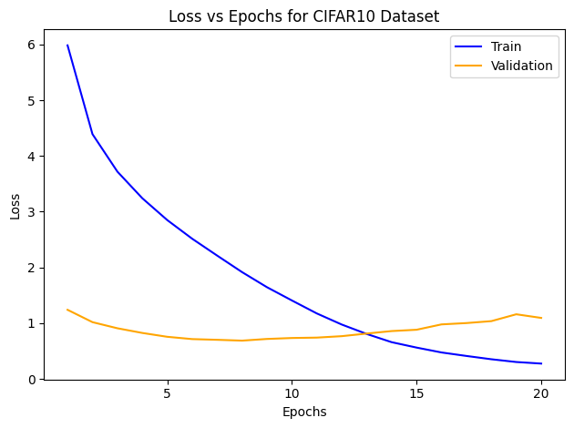
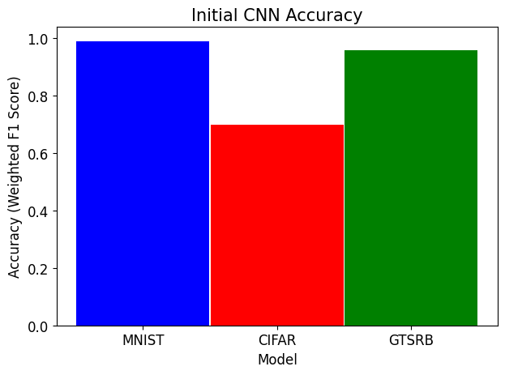

# Enhancing the Robustness of Deep Neural Networks
Repository for work on Robust Neural Networks MQP completed to satisfy the senior thesis graduation requirement at Worcester Polytechnic Institute \
Authors: Alasdair Campbell and Jared Lasselle \
Paper: [https://digital.wpi.edu/show/2v23vz553](https://digital.wpi.edu/show/2v23vz553)

### Abstract
Deep neural networks have demonstrated remarkable accuracy for most image classification machine learning tasks.  However, these networks remain susceptible 
to adversarial attacks, where slight perturbations in input data produces a misclassification.  
Without effective defense, this vulnerability  creates  a  significant  obstacle  to  the  practical  applications  of neural networks.  
Therefore, in this paper we propose four unique interpretations of adversarial attacks designed to test the limits of adversarial defenses.  
To conclude the paper we assess the strengths and weaknesses of the four defenses we designed and recommend an approach to ensure the safety and security of 
neural networks in the public domain.

We will cover highlights from the research project in this README document, hower, for a full and complete understanding of our work we encourage you to read the full paper.

To achieve the purpose of this research there are three main sections:
* [The Neural Network Architecture](#Neural-Networks)
* [The Adverserial Attack Methods](#Adverserial-Attacks)
* [The Network Defense Methods](#Defense)

## Neural Networks

Our neural network consists of 2 convolutional layers each containing a convolution and pooling layer, followed by 3 dense layers used to constrain outputs 
to the desired number of classes. Pictured below is an example of the implemented CNN structure for the MNIST Dataset.

We implemented our neural network architecture on 3 different datasets (MNIST, CIFAR, GTSRB), with picture examples used in the training and testing process 
from each dataset included below. All images were preprocessed via normalization and resizing to a 3x32x32 tensor to increase compatability with our neural network structure.

  

[MNIST Database](https://yann.lecun.com/exdb/mnist/)
[CIFAR-10 Database](https://www.cs.toronto.edu/~kriz/cifar.html)
[GTSRB Database](https://benchmark.ini.rub.de/)

### Initial Results and Accuracies
Training Loss for MNIST: \

Training Loss for CIFAR: \

Training Loss for GTSRB: \

Test Accuracy: \

Unaltered 7 from MNIST Dataset and corresponding model confidences: \
 

## Adverserial Attacks
The finalized adverserial attack methods generated by the team are:
* [FGSM and IFGSM](#Fast-Gradient-Sign-Method-(FGSM)-and-Iterative-Fast-Gradient-Sign-Method-(IFGSM))
* [DeepFool](#DeepFool)
* [Carolini and Wagner](#Carolini-and-Wagner-(CW))
* [Iterative Pixel Swap](#Iterative-Pixel-Swap)

We additionally designed a JSMA attack that ultimately we did not have time to perfect and implement for our final results, but the algorithm is included here 
as it is mostly complete.
* [JSMA](#Jacobian-Saliency-Map-Attack-(JSMA))

For each attack we provide an example of the attack being performed on an image (in this case, the digit "7" from MNIST) and the corresponding confidences produced 
by the attack and the F1 Score for the testing set for each dataset.

### Fast Gradient Sign Method (FGSM) and Iterative Fast Gradient Sign Method (IFGSM)
All code for the FGSM and IFGSM attacks are contained in the files [FGSM](Attacks/FGSM.py) | [IFGSM](Attacks/IFGSM.py) 

Example Image and Confidences: \
  

[FGSM Reference](https://arxiv.org/pdf/1412.6572)
[IFGSM Reference](https://arxiv.org/pdf/1710.06081)

### DeepFool
All code for the DeepFool attack is contained in the file [DeepFool](Attacks/DeepFool.py) 

Example Image and Confidences: \
  

[Reference](https://arxiv.org/pdf/1511.04599)

### Carolini and Wagner (CW)
All code for the CW attack is contained in the file [CW](Attacks/CW.py) 

Example Image and Confidences: \
  

[Reference](https://arxiv.org/pdf/1608.04644)

### Iterative Pixel Swap (IPS)
All code for the Iterative Pixel Swap attack is contained in the file [IPS](Attacks/IPS.py) 

Example Image and Confidences: \
  

[Reference 1](https://arxiv.org/pdf/1710.08864)
[Reference 2](https://ieeexplore.ieee.org/document/9892966)

### Jacobian Saliency Map Attack (JSMA)
All code for the JSMA attack is contained in the file [JSMA](Attacks/JSMA.py) 

[Reference](https://arxiv.org/pdf/1808.07945)

## Defense

The finalized adverserial attack methods generated by the team are:
* [Adverserial Example Training](#Adverserial-Example-Training)
* [Feature Smoothing](#Feature-Smoothing)
* [Gradient Masking](#Gradient_Masking)
* [Defensive Distillation](#Defensive-Distillation)

### Adverserial Example Training (AET)
All code for the Adverserial Example Training defense is contained in the file [AET](Defenses/AdverserialExamples.py) 

Accuracy per dataset for Adverserial Example Training: \

[Reference](https://arxiv.org/pdf/2101.05219)

### Feature Smoothing (FS)
All code for the Feature Smoothing defense is contained in the file [FS](Defenses/FeatureSqueezing.py) 

Accuracy per dataset for Feature Smoothing: \

[Reference](https://arxiv.org/pdf/1704.01155)

### Gradient Masking (GM)
All code for the Gradient Masking defense is contained in the file [GM](Defenses/GradientMasking.py) 

Accuracy per dataset for Gradient Masking: \

[Reference 1](https://arxiv.org/pdf/1802.00420)
[Reference 2](https://arxiv.org/pdf/2211.02223)

### Defensive Distillation (DD)
All code for the Defensive Distillation defense is contained in the file [DD](Defenses/Distiller.py)

Accuracy per dataset for Defensive Distillation: \
 

[Reference 1](https://ieeexplore.ieee.org/document/7546524)
[Reference 2](https://arxiv.org/pdf/1608.04644)

## Credit
All work contained in this repository is exclusively the intellectual property of Alasdair Campbell and Jared Lasselle. \
A citation for all referenced works are either contained in a hyperlink in this README, included in the Reference section of the paper, or both.